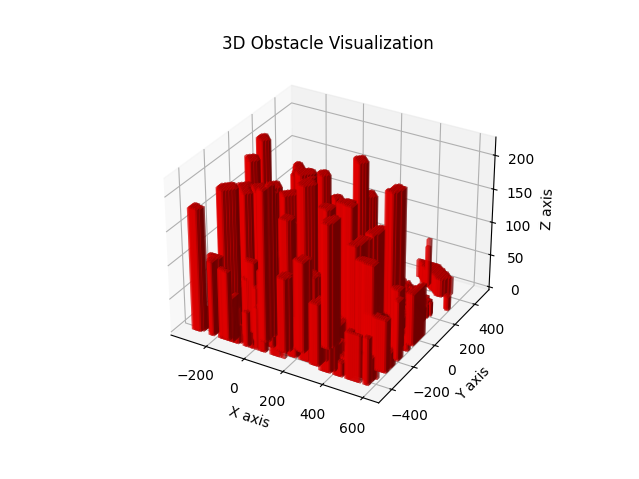
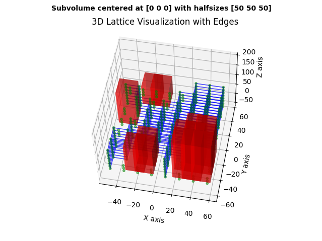
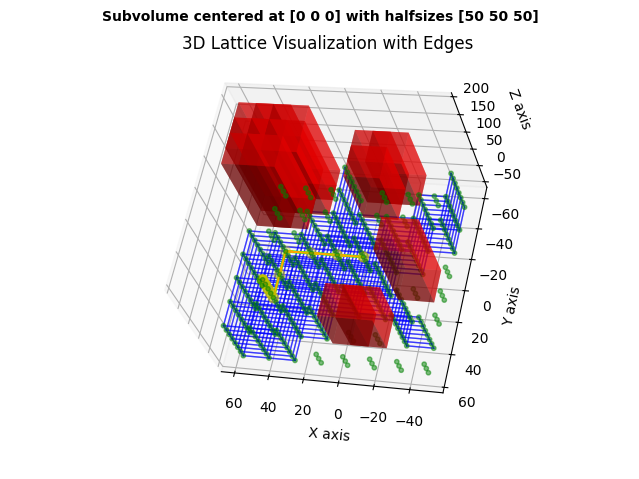
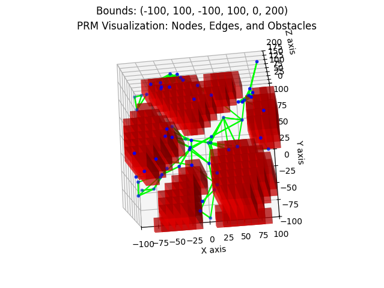
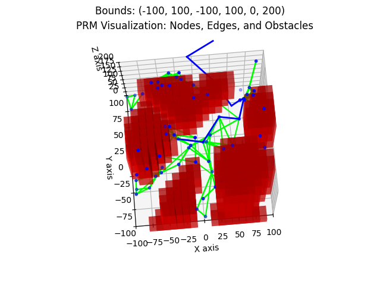
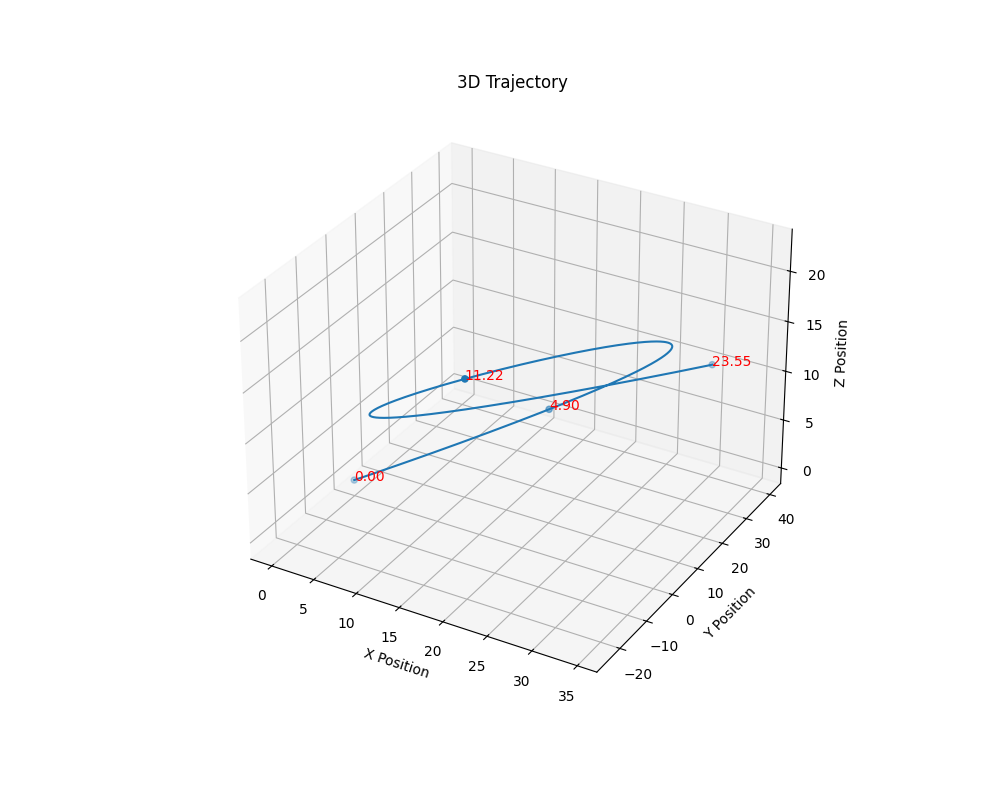
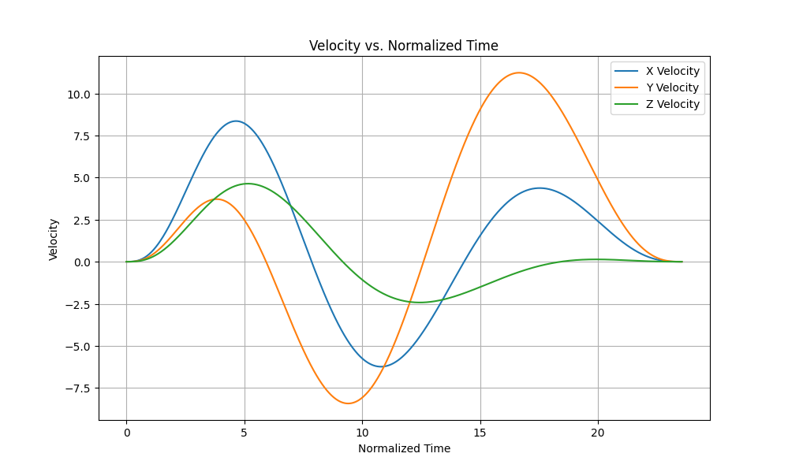
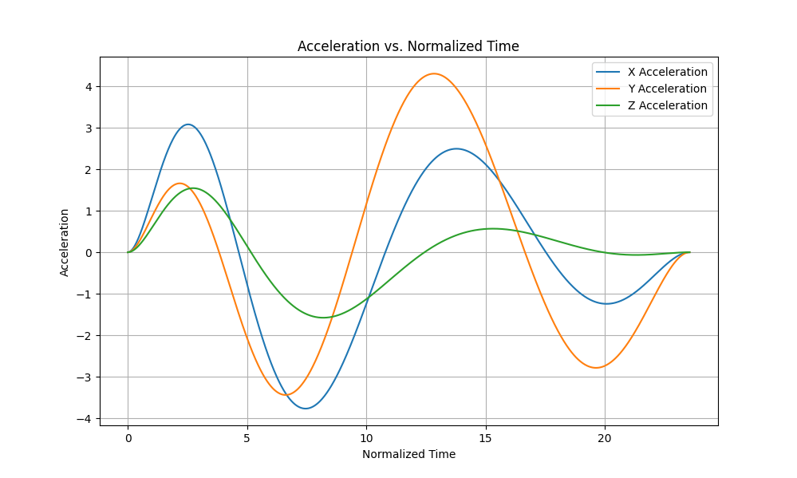
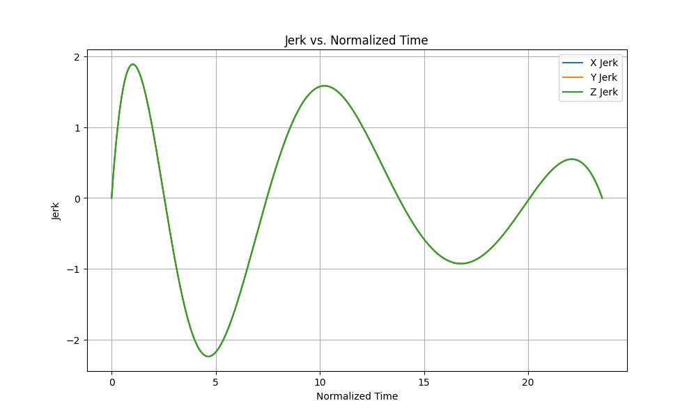
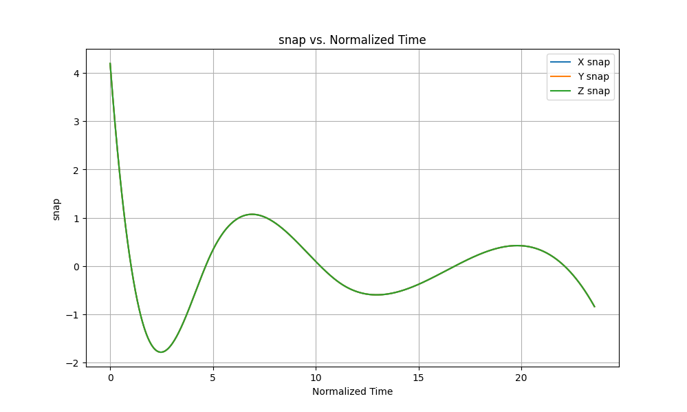

# Integrated Motion Planning Demonstration
I have engineered a Python-based motion planning pipeline for quadcopters, implementing all core algorithms (A*, PRM, RRT, and trajectory segmentation) from scratch, while incorporating unit tests, packaging, documentation, and, for demonstration and integration, a command-line interface tool. 

In brief, this motion planning pipeline software tool takes as input a user-specified configuration (`config.json`) comprising obstacle data file, start and destination GPS coordinates, and various map-building and map-searching settings, then from that configuration computes both a waypoint plan (sequence of 3D positional coordinates) and a trajectory plan (time-ordered motion profile), with all generated output data being saved to `data/output`. 

## Setup

First, clone the repository:
```
git clone https://github.com/ronen-aniti-projects/Python-Motion-Planning.git
cd Python-Motion-Planning
```

Then, install the dependencies on your system. It is recommended to use a virtual environment:

```bash 
python -m venv .venv
source .venv/bin/activate
pip install -r requirements.txt
```

## Usage
To launch the CLI:

```bash
pip install -e .
plan
```

## Demonstration 

### Overview

The CLI will walk you through each module interactively. You will be prompted to take the following steps:

1. Load the configuration.
2. Process the obstacle data.
3. Construct a representation of free-space. 
4. Execute A* and PRM path planning. 
5. Generate and visualize a trajectory.

#### The welcome message
On successfull launch, the CLI will show a welcome message: 
```
========== WELCOME ========== 
Welcome to a demonstration of Ronen Aniti's motion planning pipeline.
```

#### Prompt 1: Load the configuration
Initially, you will be prompted to load the configuration file.

```
--- Step 1: Load the configuration file ---
Press [D] to load configuration
Press [E] to exit
Your choice: 

```

If `config.json` loads correctly, you will see: 
```
Configuration successfully loaded.
```

#### Prompt 2: Load and visualize obstacle data
After loading the configuration, you will be prompted to load the obstacle data file, `data/input/colliders.csv` by default, but you can point to your own with `config.json`, key `environment`, subkey `obstacle_file`. 

```
--- Step 2: Load and visualize obstacle data ---
Press [D] to load and visualize obstacle data
Press [E] to exit
Your choice: 

```

If the obstacle data loads correctly, you will see summary obstacle metadata printed to the console, similar to this: 

```
Environment Data Summary:
Home Latitude: 37.79248
Home Longitude: -122.39745
Margin of Safety: 5.0
Centers: 
[[-310.2389   -439.2315     85.5     ]
 [-300.2389   -439.2315     85.5     ]
 [-290.2389   -439.2315     85.5     ]
 ...
 [ 257.8061    425.1645      1.75852 ]
 [ 293.9967    368.3391      3.557666]
 [ 281.5162    354.4156      4.999351]]
Half-sizes: 
[[10.       10.       90.5     ]
 [10.       10.       90.5     ]
 [10.       10.       90.5     ]
 ...
 [ 6.292725  6.292725  6.944791]
 [ 6.129456  6.129456  8.667319]
 [ 6.053772  6.053772  9.950246]]
Heights: 
[176.       176.       176.       ...   8.703311  12.224985  14.949597]
X Bounds: [-320.2389  609.7611]
Y Bounds: [-449.2315  480.7685]
Z Bounds: [ -5.396395 217.      ]
Lengths: [930.       930.       222.396395]

```

You will also be presented with a Matplotlib 3D plot of the obstacle landscape: 



#### Prompt 3: Construct a map of free-space
Next, you'll be prompted to construct a graph representation of free space: 

```
--- Step 3: Construct a map of free-space ---
Press [D] to demonstrate the lattice construction module
Press [E] to exit
Your choice: 

```

If the map construction is successful, you will see a 3D cubic lattice construction about the subvolume specified in `config.json`, key `lattice`, subkeys `center`, `halfsizes`. To change the construction's resolution or connectivity, modify subkeys `resolution`, and `connectivity` in `config.json`. Connectivity can either be `partial`, for a 6-connected lattice, or `full`, for a 26-connected lattice.



#### Prompt 4: Search for an optimal plan with A*
With the graph representation of free space constructed, the map is ready to be searched for routes. Your next prompt will be to execute the A* algorithm: 

```
--- Step 4: Search for a navigable route with A* ---
Press [D] demonstrate the A* search module
Press [E] to exit
Your choice: 

```
The A* algorithm will search for a shortest-distance path—to the resolution of the free-space lattice graph—between the start and goal GPS coordinates specified in `config.json`, key `astar`, subkeys `start_gps` and `goal_gps`. 

If a goal is found, you'll see the path visualized in 3D, with the path highlighted in orange, like so: 



#### Prompt 5: Generate a Probabilistic Roadmap plan
After generating an A* plan, you'll be prompted to build a probabilistic roadmap (a type of stochasticlly generated free-space map) and solve for a feasible path plan:

```
--- Step 5: Plan a path with PRM ---
Press [D] to execute PRM and visualize the roadmap
Press [E] to exit
Your choice: 
```

Once the roadmap is generated, you'll see it visualized in 3D: 



If the PRM build is successful, you'll also be shown a visualization of the waypoint plan, highlighted in blue: 



Controlling the PRM settings is a matter of modifying key `prm` in `config.json`. Parameters include a start and destination GPS coordinates (`start_gps` and `goal_gps`), PRM mesh density (`density`), and PRM graph branching factor (`neighbors`).

#### Prompt 6: Generate a trajectory
Finally, you'll be prompted to generate a time-ordered trajectory profile between waypoints. 

```
--- Step 6: Generate a trajectory between waypoints ---
Press [D] to generate and visualize trajectory
Press [E] to exit
Your choice: 

```

You specify waypoints in `config.json`, key `trajectory`, subkey `waypoints`. You also specify a heuristic speed (`config` subkey `average_speed`) that forces the profile to conform to a speed limit. 


If trajectory generation is successful, then you'll see the trajectory plotted in 3D:



You'll also see plots of velocity, acceleration, jerk, and snap, with position and velocity data being saved under `data/output/` as `x_position.csv`, `y_position.csv`, `z_position.csv`, `x_velocity.csv`, `y_velocity.csv`, and `z_velocity.csv`. 






